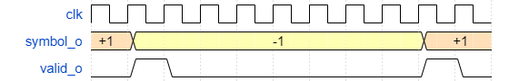

Overview
========

* Project overview
* Features
* Background knowledge
* Design idea
* Implementation
* Verification
* Demonstration
* Questions

Project overview
================

PAM-transmitter and channel filter
----------------------------------


Project overview
================

Random Data Symbol Generator
----------------------------

+---------------------+------------------------+
|   COMM              |          VLSI          |
+---------------------+------------------------+
| * MATLAB script     | * Implementation       |
| * Analysis of       |   of symbol generator  |
|                     |   in VHDL              |
|   sequence          | * Simulation of system |
| * For verification  |                        |
|                     |                        |
+---------------------+------------------------+

Project overview
================

Entity description
------------------


Features
========

  * Generates a random symbol every 8th clock cycle
  * Symbol sequence chosen by user
  * Valid and restart signal provided



Background knowledge
====================

Linear feedback shift register
------------------------------


* LFSR can be described in a mathematical polynomial: $z^{16} + z^{14} + z^{13} + z^{11} + 1$.

Background knowledge
====================

Correlation in signals
----------------------


Design idea
===========

Symbol and valid signal
-----------------------

{width=100%} 

Design idea
===========

Restart signal
--------------

{width=100%}

Implementation
=============

```vhdl
  CONSTANT PLUS1  : integer := 2**(symbol_o'length-1)-1;
  CONSTANT MINUS1 : integer := -2**(symbol_o'length-1);
  
  CONSTANT SR1_LENGTH : integer := 6;
  CONSTANT SR2_LENGTH : integer := 24;
  
  CONSTANT MOD_COUNTER1 : integer := 2**SR1_LENGTH -1;
  CONSTANT MOD_COUNTER2 : integer := 2**SR2_LENGTH -1;
  
  -- counter for valid_o signal 
  SIGNAL current_state_mod8_counter, next_state_mod8_counter: unsigned(2 DOWNTO 0);

  -- enable the shift registers with a rate of 6.25 MHz
  SIGNAL valid : std_ulogic;
  
  -- shift register 1
  SIGNAL d_sr1, q_sr1 : std_ulogic_vector((SR1_LENGTH - 1) DOWNTO 0);
  
  -- shift register 2
  SIGNAL d_sr2, q_sr2 : std_ulogic_vector((SR2_LENGTH - 1) DOWNTO 0);
  
  -- bit that is chosen for symbol decision
  SIGNAL symbol_bit : std_ulogic;
  
  -- signals for restart_o signal (counters, mod values, ...)
  SIGNAL current_state_restart_counter, next_state_restart_counter, mod_value_restart_counter: unsigned (SR2_LENGTH-1 DOWNTO 0);
```


Implementation
==============

```vhdl
  valid_o <= '1' when (current_state_mod8_counter = 0) and (rst_ni = '1') else '0';
  
  -- modulo 8 counter for valid signal
  current_state_mod8_counter <= (others => '0') when rst_ni = '0' else next_state_mod8_counter when rising_edge(clk_i);
  next_state_mod8_counter <= (current_state_mod8_counter + 1);
  valid <= '1' when current_state_mod8_counter = 7 else '0';
  
  -- shift register 1
  q_sr1 <= std_ulogic_vector(to_unsigned(INIT, q_sr1'length)) when rst_ni = '0' else d_sr1 when rising_edge(clk_i) and valid = '1';
  d_sr1((SR1_LENGTH - 2) DOWNTO 0) <= q_sr1(SR1_LENGTH-1 DOWNTO 1);
  d_sr1(SR1_LENGTH-1) <= q_sr1(1) XOR q_sr1(0);
  
  
  -- shift register 2
  q_sr2 <= std_ulogic_vector(to_unsigned(INIT, q_sr2'length)) when rst_ni = '0' else d_sr2 when rising_edge(clk_i) and valid = '1';
  d_sr2((SR2_LENGTH - 2) DOWNTO 0) <= q_sr2(SR2_LENGTH-1 DOWNTO 1);
  d_sr2(SR2_LENGTH-1) <= q_sr2(1) XOR q_sr2(0);
  
  -- choose which shift register should be chosen for the symbol decision
  symbol_bit <= q_sr1(0) when sel_pn_i = '0' else q_sr2(0);
  
  -- symbol decision
  symbol_o <= std_ulogic_vector(to_signed(PLUS1, symbol_o'length)) when symbol_bit = '0' else std_ulogic_vector(to_signed(MINUS1, symbol_o'length));
```

Implementation
==============

```vhdl  
  -- restart signal
  next_state_restart_counter <=  (current_state_restart_counter + 1) mod mod_value_restart_counter;
  current_state_restart_counter <= (others => '0') when rst_ni = '0' else next_state_restart_counter when rising_edge(clk_i) and valid = '1';
  
  mod_value_restart_counter <= to_unsigned(MOD_COUNTER1, mod_value_restart_counter'length) when sel_pn_i ='0' 
                                            else to_unsigned(MOD_COUNTER2, mod_value_restart_counter'length);
                                              
  restart_o <= '1' when current_state_restart_counter = (mod_value_restart_counter - 1) else '0';
```

Verification
============

* Simulation
    * Check frequencies of necessary signals
* MATLAB
    * Calculate correlation between the symbols
    * MATLAB generates a reference file
    * VHDL testbench generates also symbol file
    * Compare these both files 


Demonstration
=============


Questions?
=========

Thank you for your attention !
