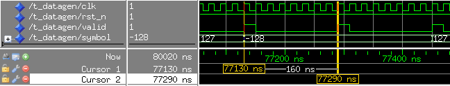

Introduction
==============
\label{sec::intro}

{width=100%}

This report describes one of three subprojects which together are combined into one large application as shown in Figure \ref{project_overview}.
The overall application is a PAM-transmitter connected with a simulated channel filter.
The PAM-transmitter can be seen in Figure \ref{overview_pam} and the mentioned Channel Filter shall be applied to the signal $s(t)$. 
This system runs on an FPGA board that uses a default clock of 50MHz.
The PAM-transmitter, comprising both Symbol Generator and  Transmit Filter forms the basis of two of the three subprojects, with a Channel Filter providing the basis for the third.
The symbol generator, with a symbol rate defined in the project specification which is eight times slower than the system clock,  provides a new symbol with a rate of 6.25 MHz.
The generated data are used by the Transmit Filter initially by upsampling the symbol stream by a factor of \textit{L} and then filtering, resulting in the sample rate.
This process can be done collectively using a Polyphase FIR filter (Mini Project 2).
The channel filter (Mini Project 3) basically is a comb filter that has a variable delay and amplification.
In this project the first component of the PAM-transmitter, the symbol generator, is implemented.
As shown in Figure \ref{overview_pam} the symbol generator basically consists of a bit source and a bit-to-symbol-mapper.

{width=70%}

In an ideal world each symbol produced by a symbol generator would be entirely arbitrary and so each symbol produced would have no correlation to the last.
As we cannot simulate ideal world conditions, it is necessary to use two different pseudo-random sequences for the Symbol Generator which shall be chosen by the user.

Background
============

The symbol generator in figure \ref{overview_pam} basically consists of a bit generation (bit source) and a symbol decision (bit-to-symbol mapper).
The bit source is taken from one of two possible Linear Feedback Shift Registers (LFSRs), which create a pseudo-random collection of bits. 
These bits are then mapped to either +1 or -1 for bits 0 and 1 respectively. 
Basically, this mapping can be compared with a Binary Phase Shifting Key (BPSK). 
BPSK is a two-phase modulation scheme where two bits (0 and 1) are represented as two different phase states on a constellation as shown in Figure \ref{bpsk} (in this case, +1 and -1).

{width=50%}

The symbol generator in this project produces a string of symbols that are not fully randomized.
However, a series of pseudo-random symbols can be produced using a Fibonacci LFSR which repeats itself after a certain number of symbols (defined by the length of the LFSR).
For example, if the size of the LFSR contains \textit{m} flip-flops, then the resulting maximum length of the sequence is $2^m -1$.

{width=100%}

The Fibonacci LFSR uses a shift register of a certain length, sets an initial condition to each Flip-Flop and creates feedback from one end to the other.
With an initial condition we can set some of these Flip Flops to 0 and others to 1 while resetting the system.
The feedback can be as simple as feeding the signal from one end to the other.
Alternatively, it can be created with XOR gates which are fed by other signals of the LFSR.
In the above example, the XOR gates get their inputs from FF 11, 13, 14, and 16.
The inputs that are combined in the XOR gates can be described in a mathematical polynomial.
For this example the equation would be $z^{16} + z^{14} + z^{13} + z^{11} + 1$.
The 1 in this equation does not represent a source for an  XOR gate; instead, it tells that the output of the XOR gates is fed to the first bit of the register.

As mentioned in Section \ref{sec::intro} the generated symbols should be entirely arbitrary.
If you calculate the correlation between these symbols it should create a perfect Dirac impulse.
However, as a perfectly random string of symbols is impossible to implement practically, we must endure some level of correlation in our symbol stream.
We can calculate this correlation and plot the result with MATLAB which shall be discussed further in section \ref{Ver_with_MATLAB}. 


Features
=========

The Random Signal Data Symbol Generator produces random symbols (+1 and -1) with a frequency of 6.25 MHz for a transmitter.
Unfortunately, it is not possible to produce a perfect random string of symbols.
However, an acceptable level of randomness can be obtained using a pseudo-random symbol generator.
An LFSR with a specific length can produce a set number of pseudo-random sequences before repeating itself. 
As defined in the project specification, this task requires two separate sequence lengths of either $2^6-1$ or $2^{24}-1$.

A  user input allows one to switch between the different sequences provided by the two shift registers. 
To show at which point of time a new valid symbol can be sampled, a valid signal is produced. 
Additionally, a restart signal is created to indicate when the currently selected sequence repeats itself. 
The user can produce many different series of symbols by setting the initial conditions differently. 


General Description
===================

The content of this project can be broken down into 2 main parts. 
Firstly, to create a symbol generator in MATLAB which generates a list of pseudo-random bits, maps them to the correct symbols and stores this list for later confirmation.
MATLAB should also be used to generate an correlation diagram to show the level of randomness of the final symbol stream.
The second part of the project involves implementing the symbol generator using VHDL and comparing the results to those produced in MATLAB.
If both strings of data produced are the same, then it can be assumed that we have a working system.

The entity of the symbol generator that is implemented in VHDL is shown in Figure \ref{entity} below.
An input signal is taken as sel_pn_i, and three outputs as restart_o, valid_o and symbol_o.


| **Name**    | **Type**          | **Direction** | **Polarity** | **Description** |
|-------------|-------------------|:-------------:|:------------:|-----------------|
| clk_i       | std_ulogic        | IN            | HIGH         | clock           |
| rst_ni      | std_ulogic        | IN            | LOW          | reset           |
| sel_pn_i    | std_ulogic        | IN            | HIGH         | select lfsr     |
| restart_o   | std_ulogic        | OUT           | HIGH         | sequence repeat |
| valid_o     | std_ulogic        | OUT           | HIGH         | symbol is valid |
| symbol_o    | std_ulogic_vector | OUT           | HIGH         | symbol          |

: Symbol generator - Description of I/O Signals


Design Description
=====================

In general, the design idea of the symbol generator can be seen in Figures \ref{symbol} and \ref{restart}.


Figure \ref{symbol} shows a basic block diagram of the Symbol Generator.
The output symbol_o of the model contains the desired symbol of the system depending on the value generated by the LFSR.
The Mod8 counter counts from 0 to 7 in 8 clock cycles. 
On the 8th clock cycle the shift registers will be shifted.
One clock cycle later, that is, at the first clock cycle of the new symbol, the valid_o signal outputs a 1.
This scales the clock to a frequency of 6.25 MHz (i.e. 8 times slower than the default FPGA clock). 
This description of the valid_o signal leads to the timing diagram shown in Figure \ref{timing_valid}. 

{width=100%}

As can be seen in the diagram above, the symbol is stable for 8 clock cycles and the valid signal is turned on for 1 clock cycle as soon as the new symbol is produced.
This process effectively reduces the symbol rate to one eighth of the default clock frequency. 


The shift register to be used as a symbol bit for the mapping can be chosen with sel_pn_i as the selector.
The shift register that is chosen may be configured to a user input later (e.g. a key or switch on the FPGA board).
The final symbol_o is determined by the output of a multiplexer which has a switching condition of the symbol bit.
This changes the selected value to either +1 or -1 which is used as the input for the Polyphase FIR Filter in Mini-Project 2. 


Figure \ref{restart} is another basic block diagram that shows how a programmable modulo counter can be used to generate the restart_o signal. 
This signal indicates the point at which the sequence of the currently selected shift register repeats itself.
The ‘m’ in Figure \ref{restart} does not apply to the length of the shift register but represents the modulo_value so equals either $2^6-1$ or $2^{24}-1$.
The sel_pn_i signal selects the shift register to be used as the symbol bit and programs the modulo counter to compare the current counter value to the modulo_value – 1, thereby determining when the sequence of the selected shift register repeats.

Figure \ref{LFSR} below shows a representation of our Fibonacci LFSR that creates a sequence with a maximum length of $2^6-1$ symbols.
The design of our LFSR differs from that displayed in Figure \ref{Example_LFSR} as two Flip-Flops rather than four are used to act as an input to our XOR gate (Flip-Flops 5 and 6).
The rightmost register is used as the output of the LFSR and is named symbol_bit, which can be seen in Figure \ref{symbol}. 

{width=100%}

Verification
==============

Two steps were used to verify our design.
Firstly, in simulation with Modelsim, the basic functionality was tested.
This means that periods of the valid_o signal and restart signal and the basic symbol generation are evaluated.
Secondly, it was tested if a MATLAB generated symbol sequence can be reproduced from the VHDL design and calculated how random the produced sequence really is.

Verification in simulation
-------------------------------

In the simulation the design was reset and run as long as was needed to produce the desired amount of symbols.
With setting cursors in the generated waves it is possible to determine the frequency of the valid and the restart signal.
The following snippet in Figure \ref{valid} from the simulation the period of the valid signal was measured:



The period of the valid signal is 160 ns which means that the frequency is 6.25MHz according to $f = \frac{1}{T} = \frac{1}{160ns} = 6.25 MHz$

It also tests if the restart signal is triggered at the correct frequency. 
For this, channel 0 is selected in the testbench which means that the LFSR with a maximum sequence length of $2^6-1 = 63$ is selected.


The period of the signal is 10080 ns which results in 63 symbols according to $\frac{10080 ns}{8 \cdot 20 ns} = 63$.
In this calculation $8 \cdot 20 ns$ describes the symbol period.


Verification with MATLAB
-----------------------------
\label{Ver_with_MATLAB}

In MATLAB it is possible to create a Fibonacci LFSR with the so called [PseudoNumber Generator](https://de.mathworks.com/help/comm/ref/comm.pnsequence-system-object.html).
This is embedded in a script that produces a pseudo random symbol sequence with a certain length.
This sequence can be written into a file that is then compared to a file that is written by a testbench for the VHDL design.


```Matlab
close all; clear *;

% Whether data shall be written to file or not
writeDataToFile = 1;

% use 2^6-1 or 2^24-1 as maximum sequence length
use_six = true;

% Create PN-sequence object with maximum-length sequence
lfsr = comm.PNSequence;
if use_six == true
    lfsr.Polynomial = [6 1 0];
    lfsr.InitialConditions = [1 1 0 0 0 0];
else
    lfsr.Polynomial = [24 1 0];
    ic = zeros(1,24,'uint32');
    ic(1) = 1;
    ic(2) = 1;
    lfsr.InitialConditions = ic;
end

% if you use second lfsr you should produce ~20000 samples per frame to get the desired correlation
lfsr.SamplesPerFrame = 500;

disp(['Initial state of LFSR: ' num2str(bin2dec(num2str(lfsr.InitialConditions)))]);

% Create pseudo-random bit sequence
bits = lfsr();

% Bit-to-symbol mapping with w_out as symbol wordlength
w_out = 8;
symbols = []; % Requires your input
for i = 1:lfsr.SamplesPerFrame
   if bits(i) == 1
      symbols(i) = -1; 
   else
      symbols(i) = 1;
   end
end

% Save output data to file to compare to VHDL-model (integer representation)
if writeDataToFile == 1
 save_variable(symbols, '%d', '../sim/datagen/log/datagen_result_ref.dat');
end

% Plot bit sequence
figure(1);
subplot(211);
stem(bits(1:10)); box off;
yticks([0 1]);
xlabel('Symbol index n \rightarrow'); ylabel('Bit \rightarrow');

% Autocorrelation
autocorr = dsp.Autocorrelator;
autocorr.MaximumLagSource = 'Property';
autocorr.MaximumLag = 50;
autocorr.Scaling = 'Biased';

% Calculate autocorrelation up to some lag
exx = autocorr(symbols'); % Requires your input

subplot(212);
stem(exx); box off; % Requires your input
xlabel('Lag i \rightarrow'); ylabel('E{x[n]x^*[n-i]} \rightarrow');
```

Autocorrelation is the correlation of a signal with a delayed copy of itself as a function of delay and so it is the similarity of a signal over a set period of lag.
From Figure \ref{autocorrelation}, we can observe two plots, the first is the symbol bit defined by the output of the first LFSR.
In this case the first ten bits show {0,0,0,0,1,1,0,0,0,1}.
The lower plot displays the autocorrelation of the signal.
We see a Dirac puls at at lag of 1 and at the other lags a correlation nearly zero what means that our signal is already pretty random and uncorrelated.
As some points lie very close to zero fluctuating about it slightly, we must assume that our signal is not perfectly random. 
Although a small level of correlation between the bits is produced by the LFSR it is acceptable for this application.
The plots shown in Figure \ref{autocorrelation} are used to depict our first LFSR with a length of $2^6-1$ and we use a value of 500 symbols per frame to show this.
To show our second LFSR correctly we must set the symbols per frame to a much higher value e.g. 20000 to avoid wrapping of the signal. 


{width=65%}


If the file generated by MATLAB is the same as the one generated by the testbench in Modelsim then it will be possible to reproduce the symbol sequence from MATLAB in the VHDL design.
With the following python script these two files were compared with each other.
As our MATLAB script produces +1 and -1 for the symbols that equal 127 and -128 in the file that was written by the VHDL testbench, it is necessary to first convert the testbench generated file into the desired format.

```python
import filecmp
from pathlib import Path

if __name__ == "__main__":
    matlab_file = "log/datagen_result_ref.dat"
    vhdl_file = "log/datagen_result.dat"
    with open(vhdl_file, "rt") as f:
        content = f.readlines()
     
    # matlab generates 1 and -1 as symbols so we have to replace 127 and -128 in our file
    # that was generated by testbench
    new_content = list()
    for line in content:
        if '127' in line:
            line = line.replace('127', '1')
        elif '128' in line:
            line = line.replace('-128', '-1')
        new_content.append(line)

    # write the new file
    with open(vhdl_file, "w") as f:
        for line in new_content:
            f.write(line)

    # check if the same amount of symbols was generated
    if Path(matlab_file).stat().st_size == Path(vhdl_file).stat().st_size:
        # check if the files are the same
        if filecmp.cmp(matlab_file, vhdl_file) is True:
            print("The files are the same")
        else:
            print("The files are not the same")
    else:
        print("The files do not have the same byte size, probably not the same amount of symbols generated")
```

Application Note
================

The following test environment on a DE1 prototype board uses a system clock frequency of 50 MHz.
A prescaler is parameterised to generate an output signal with a period of 1 ms.


Appendix
========

{width=50%}

References
----------

* [Wiki: Fibonacci Linear-feedback shift register](https://en.wikipedia.org/wiki/Linear-feedback_shift_register#/media/File:LFSR-F16.svg)

Project Hierarchy
-----------------

### Module Hierarchy for Verification

```pure
t_datagen_fileio(tbench)
  datagen_structure(rtl)
```

### Prototype Environment

Produced by Prof. Dr.-Ing Matthias Kamuf

VHDL Sources
------------

```vhdl
LIBRARY IEEE;
USE IEEE.std_logic_1164.ALL;
USE IEEE.numeric_std.ALL;

ENTITY datagen IS
  GENERIC (
    INIT : integer);
  PORT (
    clk_i     : IN  std_ulogic;
    rst_ni    : IN  std_ulogic;
    sel_pn_i  : IN  std_ulogic;
    restart_o : OUT std_ulogic;
    valid_o   : OUT std_ulogic;
    symbol_o  : OUT std_ulogic_vector(7 DOWNTO 0));
END datagen;

ARCHITECTURE structure OF datagen IS

  CONSTANT PLUS1  : integer := 2**(symbol_o'length-1)-1;
  CONSTANT MINUS1 : integer := -2**(symbol_o'length-1);
  
 
  CONSTANT SR1_LENGTH : integer := 6;
  CONSTANT SR2_LENGTH : integer := 24;
  
  CONSTANT MOD_COUNTER1 : integer := 2**SR1_LENGTH -1;
  CONSTANT MOD_COUNTER2 : integer := 2**SR2_LENGTH -1;
  
  -- counter for valid_o signal 
  SIGNAL current_state_mod8_counter, next_state_mod8_counter: unsigned(2 DOWNTO 0);

  -- enable the shift registers with a rate of 6.25 MHz
  SIGNAL valid : std_ulogic;
  
  -- shift register 1
  SIGNAL d_sr1, q_sr1 : std_ulogic_vector((SR1_LENGTH - 1) DOWNTO 0);
  
  
  -- shift register 2
  SIGNAL d_sr2, q_sr2 : std_ulogic_vector((SR2_LENGTH - 1) DOWNTO 0);
  
  -- bit that is chosen for symbol decision
  SIGNAL symbol_bit : std_ulogic;
  
  -- signals for restart_o signal (counters, mod values, ...)
  SIGNAL current_state_restart_counter, next_state_restart_counter, mod_value_restart_counter: unsigned (SR2_LENGTH-1 DOWNTO 0);

BEGIN
  
  valid_o <= '1' when (current_state_mod8_counter = 0) and (rst_ni = '1') else '0';
  
  -- modulo 8 counter for valid signal
  current_state_mod8_counter <= (others => '0') when rst_ni = '0' else next_state_mod8_counter when rising_edge(clk_i);
  next_state_mod8_counter <= (current_state_mod8_counter + 1);
  valid <= '1' when current_state_mod8_counter = 7 else '0';
  
  -- shift register 1
  q_sr1 <= std_ulogic_vector(to_unsigned(INIT, q_sr1'length)) when rst_ni = '0' else d_sr1 when rising_edge(clk_i) and valid = '1';
  d_sr1((SR1_LENGTH - 2) DOWNTO 0) <= q_sr1(SR1_LENGTH-1 DOWNTO 1);
  d_sr1(SR1_LENGTH-1) <= q_sr1(1) XOR q_sr1(0);
  
  
  -- shift register 2
  q_sr2 <= std_ulogic_vector(to_unsigned(INIT, q_sr2'length)) when rst_ni = '0' else d_sr2 when rising_edge(clk_i) and valid = '1';
  d_sr2((SR2_LENGTH - 2) DOWNTO 0) <= q_sr2(SR2_LENGTH-1 DOWNTO 1);
  d_sr2(SR2_LENGTH-1) <= q_sr2(1) XOR q_sr2(0);
  
  -- choose which shift register should be chosen for the symbol decision
  symbol_bit <= q_sr1(0) when sel_pn_i = '0' else q_sr2(0);
  
  -- symbol decision
  symbol_o <= std_ulogic_vector(to_signed(PLUS1, symbol_o'length)) when symbol_bit = '0' else std_ulogic_vector(to_signed(MINUS1, symbol_o'length));
  
  -- restart signal
  next_state_restart_counter <=  (current_state_restart_counter + 1) mod mod_value_restart_counter;
  current_state_restart_counter <= (others => '0') when rst_ni = '0' else next_state_restart_counter when rising_edge(clk_i) and valid = '1';
  
  mod_value_restart_counter <= to_unsigned(MOD_COUNTER1, mod_value_restart_counter'length) when sel_pn_i ='0' 
                                            else to_unsigned(MOD_COUNTER2, mod_value_restart_counter'length);
                                              
  restart_o <= '1' when current_state_restart_counter = (mod_value_restart_counter - 1) else '0';
  
END structure;
```

```vhdl
LIBRARY IEEE;
USE IEEE.std_logic_1164.ALL;
USE IEEE.numeric_std.ALL;
USE STD.textio.ALL;

ENTITY t_datagen IS

END t_datagen;

ARCHITECTURE tbench OF t_datagen IS

  COMPONENT datagen IS
    GENERIC (
      INIT : integer);
    PORT (
      clk_i     : IN  std_ulogic;
      rst_ni    : IN  std_ulogic;
      sel_pn_i  : IN  std_ulogic;
      restart_o : OUT std_ulogic;
      valid_o   : OUT std_ulogic;
      symbol_o  : OUT std_ulogic_vector(7 DOWNTO 0));
  END COMPONENT datagen;

  -- component ports
  SIGNAL clk    : std_ulogic;
  SIGNAL rst_n  : std_ulogic;
  SIGNAL valid  : std_ulogic;
  SIGNAL symbol : std_ulogic_vector(7 DOWNTO 0);

  -- definition of a clock period
  CONSTANT period : time    := 20 ns;
  -- switch for clock generator
  SIGNAL clken_p  : boolean := true;

BEGIN

  -- component instantiation
  DUT : datagen
    GENERIC MAP (
      INIT => 12582912) -- OBS! some initial value is required here
    PORT MAP (
      clk_i     => clk,
      rst_ni    => rst_n,
      sel_pn_i  => '1',
      restart_o => OPEN,
      valid_o   => valid,
      symbol_o  => symbol);

  -- clock generation
  clock_proc : PROCESS
  BEGIN
    WHILE clken_p LOOP
      clk <= '0'; WAIT FOR period/2;
      clk <= '1'; WAIT FOR period/2;
    END LOOP;
    WAIT;
  END PROCESS;

  reset : rst_n <= '0', '1' AFTER period;

  observer : PROCESS
    VARIABLE Lo     : line;             -- pointer to file output buffer
    VARIABLE Vo     : integer;
    FILE resultfile : text OPEN write_mode IS "log/datagen_result.dat";

  BEGIN

    WAIT UNTIL rst_n = '1';             -- wait for reset

    FOR k IN 0 TO 4*10**3-1 LOOP
      WAIT UNTIL clk = '1';
      IF valid = '1' THEN
        Vo := to_integer(signed(symbol));
        write(Lo, Vo);
        writeline(resultfile, Lo);
      END IF;
    END LOOP;

    clken_p <= false;                   -- switch off clock generator

    WAIT;
  END PROCESS;
END tbench;


```
